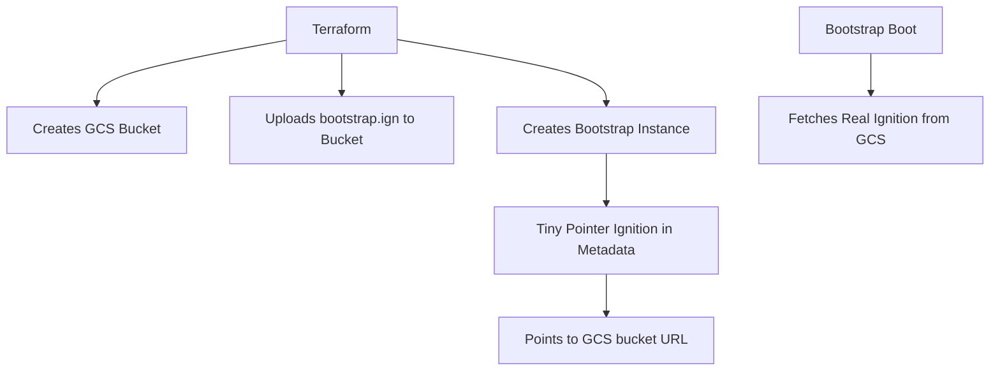

# OpenShift 4.19 UPI Infrastructure on Google Cloud Platform

This Terraform configuration creates the infrastructure required for an OpenShift 4.19 User Provisioned Infrastructure (UPI) installation on Google Cloud Platform.

## Architecture Overview

### Ignition File Strategy & GCP Metadata Limitations

This deployment uses a **hybrid ignition approach** to handle GCP's metadata size constraints:

**The Challenge**: GCP instance metadata has a 262KB limit, but OpenShift's `bootstrap.ign` file is ~300KB.

**Our Solution**:
- **Master & Worker Nodes**: Load ignition configs directly via metadata (`master.ign`, `worker.ign` ~1.7KB each)
- **Bootstrap Node**: Uses GCS bucket approach with pointer ignition

### Bootstrap GCS Bucket Pattern



**Bootstrap Pointer Structure**:
```json
{
  "ignition": {
    "version": "3.2.0", 
    "config": {
      "merge": [{
        "source": "https://storage.googleapis.com/bucket-name/bootstrap.ign"
      }]
    }
  }
}
```

**Why This Works**:
- Pointer ignition: ~200 bytes (fits in metadata)
- Real bootstrap.ign: ~300KB (stored in GCS)
- RHCOS fetches full config during ignition phase
- Service account has bucket read permissions

## Infrastructure Components

- **Private VPC** with 3 subnets (one per availability zone)
- **3 Control Plane nodes** distributed across the 3 AZs
- **3 Worker nodes** distributed across the 3 AZs
- **Custom RHCOS Image** created from OpenShift mirror tar.gz
- **Service Account** with minimal required permissions
- **VIP for Apps/Ingress** pointing to worker nodes
- **Private DNS Zone** with automated record management
- **Firewall Rules** for secure cluster communication (API 6443, MCS 22623, Ingress 80/443)
- **Secondary IP ranges** for pods and services (one per AZ)
- **GCS Bucket** for bootstrap ignition file storage (handles metadata size limits)
- **Bootstrap Node** with pointer ignition pattern for large config files
- **Optional Bastion Host** for secure cluster access (configurable via `enable_bastion` variable)

## Prerequisites

1. **Google Cloud SDK** installed and configured
2. **Terraform** >= 1.0 installed
3. **OpenShift installer** for generating ignition configs
4. **Valid GCP project** with billing enabled
5. **Required APIs enabled**:
   - Compute Engine API
   - Cloud Resource Manager API
   - IAM Service Account Credentials API
   - Cloud DNS API

## Quick Start

### 1. Enable Required APIs

```bash
gcloud services enable compute.googleapis.com
gcloud services enable cloudresourcemanager.googleapis.com
gcloud services enable iamcredentials.googleapis.com
gcloud services enable dns.googleapis.com
```

### 2. Configure Authentication

```bash
# Authenticate with GCP
gcloud auth login
gcloud auth application-default login

# Set your project
gcloud config set project YOUR_PROJECT_ID
```

### 3. Prepare Configuration

```bash
# Clone or download this configuration
cp terraform.tfvars.example terraform.tfvars

# Edit terraform.tfvars with your values
nano terraform.tfvars
```

### 4. RHCOS Image Creation

**Important**: You must manually create the RHCOS image before running Terraform, as GCP cannot directly create images from external URLs.

#### Step 1: Download RHCOS Image Locally
```bash
# Download the RHCOS image for GCP
curl -o rhcos-4.19.10-x86_64-gcp.x86_64.tar.gz \
  https://mirror.openshift.com/pub/openshift-v4/dependencies/rhcos/4.19/4.19.10/rhcos-4.19.10-x86_64-gcp.x86_64.tar.gz

# Verify the download
ls -lh rhcos-4.19.10-x86_64-gcp.x86_64.tar.gz
```

#### Step 2: Upload to Google Cloud Storage
```bash
# Create a temporary bucket for the image upload
gsutil mb gs://${PROJECT_ID}-rhcos-images

# Upload the RHCOS tar.gz file
gsutil cp rhcos-4.19.10-x86_64-gcp.x86_64.tar.gz gs://${PROJECT_ID}-rhcos-images/

# Verify upload
gsutil ls -l gs://${PROJECT_ID}-rhcos-images/
```

#### Step 3: Create GCP Image
```bash
# Create the RHCOS image in GCP
gcloud compute images create rhcos-4-19-10 \
  --source-uri gs://${PROJECT_ID}-rhcos-images/rhcos-4.19.10-x86_64-gcp.x86_64.tar.gz \
  --family rhcos \
  --description "Red Hat CoreOS 4.19.10 for OpenShift"

# Verify image creation
gcloud compute images describe rhcos-4-19-10

# Clean up the temporary bucket (optional)
gsutil rm gs://${PROJECT_ID}-rhcos-images/rhcos-4.19.10-x86_64-gcp.x86_64.tar.gz
gsutil rb gs://${PROJECT_ID}-rhcos-images
```

#### Alternative: One-liner Script
```bash
# Set your project ID
export PROJECT_ID=$(gcloud config get-value project)

# Download, upload, and create image in one go
curl -o rhcos-4.19.10-x86_64-gcp.x86_64.tar.gz \
  https://mirror.openshift.com/pub/openshift-v4/dependencies/rhcos/4.19/4.19.10/rhcos-4.19.10-x86_64-gcp.x86_64.tar.gz && \
gsutil mb gs://${PROJECT_ID}-rhcos-temp && \
gsutil cp rhcos-4.19.10-x86_64-gcp.x86_64.tar.gz gs://${PROJECT_ID}-rhcos-temp/ && \
gcloud compute images create rhcos-4-19-10 \
  --source-uri gs://${PROJECT_ID}-rhcos-temp/rhcos-4.19.10-x86_64-gcp.x86_64.tar.gz \
  --family rhcos \
  --description "Red Hat CoreOS 4.19.10 for OpenShift" && \
gsutil rm gs://${PROJECT_ID}-rhcos-temp/rhcos-4.19.10-x86_64-gcp.x86_64.tar.gz && \
gsutil rb gs://${PROJECT_ID}-rhcos-temp && \
rm rhcos-4.19.10-x86_64-gcp.x86_64.tar.gz
```

**Note**: The Terraform configuration expects an image named `rhcos-4-19-10` to exist in your project. This step must be completed before running `terraform apply`.

### 5. Generate OpenShift Ignition Configs

Before applying Terraform, you need to generate ignition configurations:

```bash
# Download OpenShift installer
wget https://mirror.openshift.com/pub/openshift-v4/clients/ocp/4.19.x/openshift-install-linux.tar.gz
tar -xzf openshift-install-linux.tar.gz

# Create install-config.yaml
./openshift-install create install-config --dir=./openshift-config

# Generate ignition configs
./openshift-install create ignition-configs --dir=./openshift-config
```

Update your `terraform.tfvars` with the ignition file paths:

```hcl
control_plane_ignition_config = file("./openshift-config/master.ign")
worker_ignition_config        = file("./openshift-config/worker.ign")
```

### 6. Deploy Infrastructure

```bash
# Initialize Terraform
terraform init

# Plan the deployment
terraform plan

# Apply the configuration
terraform apply
```

### 7. Verify DNS Configuration

After deployment, verify the automatically configured DNS entries:

```bash
# Get the DNS configuration
terraform output dns_entries
```

The following DNS records are automatically created in the private DNS zone:
- `api.ocp.j7ql2.gcp.redhatworkshops.io` → All control plane node IPs (load balanced)
- `*.apps.ocp.j7ql2.gcp.redhatworkshops.io` → All worker node IPs (load balanced)

**Note**: The `api-int` DNS record is not needed - OpenShift handles internal API communication automatically through built-in service discovery.

### 8. Complete OpenShift Installation

```bash
# Monitor the installation
./openshift-install wait-for bootstrap-complete --dir=./openshift-config --log-level=info

# After bootstrap completion, remove bootstrap node and continue
./openshift-install wait-for install-complete --dir=./openshift-config --log-level=info
```

## Configuration Variables

| Variable | Description | Default | Required |
|----------|-------------|---------|----------|
| `project_id` | GCP Project ID | - | Yes |
| `cluster_name` | OpenShift cluster name | - | Yes |
| `domain_name` | Base domain name for the cluster | `ocp.j7ql2.gcp.redhatworkshops.io` | No |
| `region` | GCP region | `us-central1` | No |
| `zones` | Availability zones | `["us-central1-a", "us-central1-b", "us-central1-c"]` | No |
| `subnet_cidrs` | Subnet CIDR blocks (one per AZ) | `["10.0.1.0/24", "10.0.2.0/24", "10.0.3.0/24"]` | No |
| `pod_cidrs` | Pod CIDR blocks (one per AZ) | `["10.128.0.0/16", "10.129.0.0/16", "10.130.0.0/16"]` | No |
| `service_cidr` | Service CIDR block | `172.30.0.0/16` | No |
| ~`apps_vip_ip`~ | ~Internal IP for apps/ingress VIP~ | ~`10.0.1.10`~ | Removed - using direct DNS |
| `ocp_version` | OpenShift version | `4.19` | No |
| `rhcos_version` | RHCOS version | `4.19.10` | No |
| `control_plane_machine_type` | Control plane VM size | `e2-standard-4` | No |
| `worker_machine_type` | Worker node VM size | `e2-standard-4` | No |

## Security Considerations

- **No external IPs** assigned to compute instances
- **Firewall rules** restrict access to necessary ports only
- **Service account** has minimal required permissions
- **Private subnet** isolates cluster from internet

## Networking

- **VPC**: Dedicated network for the cluster
- **Subnets**: 3 private subnets, one per availability zone
- **Secondary ranges**: Separate pod ranges per AZ, shared service range
- **Apps VIP**: Internal IP address for ingress/router traffic (in first subnet)
- **Private DNS**: Automated DNS zone with cluster records
- **Distribution**: Control plane and worker nodes distributed across all 3 AZs

## Resource Requirements

### Minimum Specifications
- **Control Plane**: 3 × e2-standard-4 (4 vCPU, 16GB RAM, 120GB disk)
- **Workers**: 3 × e2-standard-4 (4 vCPU, 16GB RAM, 120GB disk)

### Recommended for Production
- **Control Plane**: 3 × e2-standard-8 (8 vCPU, 32GB RAM, 200GB disk)
- **Workers**: 3+ × e2-standard-8 (8 vCPU, 32GB RAM, 200GB disk)

## Troubleshooting

### Common Issues

1. **API not accessible**: Check DNS records point to control plane nodes, not bootstrap
2. **Worker nodes not joining**: Check for pending CSRs that need approval: `kubectl get csr`
3. **Console/Apps not accessible**: Verify apps DNS points to worker nodes, not VIP
4. **Bootstrap stuck**: Check DNS resolution and MCS port 22623 accessibility
5. **Permission errors**: Ensure service account has required roles

### Post-Installation Steps

After `terraform apply`, you may need to:

1. **Approve pending CSRs** to allow worker nodes to join:
   ```bash
   kubectl get csr
   kubectl certificate approve <csr-name>
   ```

2. **Wait for cluster operators** to become available:
   ```bash
   kubectl get clusteroperators
   ```

3. **Access the web console**:
   ```bash
   kubectl -n openshift-console get route console
   ```

### Useful Commands

```bash
# Check Terraform state
terraform show

# Get outputs
terraform output

# Destroy infrastructure (careful!)
terraform destroy
```

## Clean Up

To remove all resources:

```bash
terraform destroy
```

**Warning**: This will permanently delete all infrastructure created by this configuration.

## Support

This configuration is provided as-is for OpenShift 4.19 UPI installations. For production deployments:

- Review and adjust firewall rules for your security requirements
- Consider using Cloud NAT for outbound internet access
- Implement proper backup and disaster recovery procedures
- Monitor resource usage and scale appropriately

## License

This configuration is provided under the MIT License.